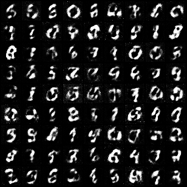
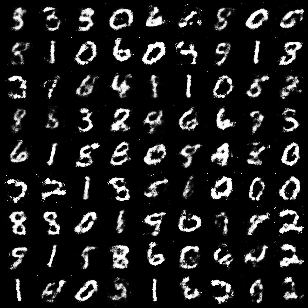
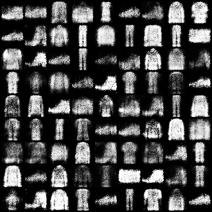
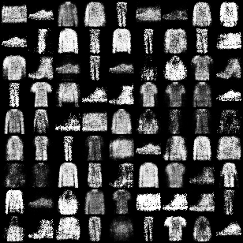

## GAN

### Table of Contents
1. [Architecture](#Architecture)
1. [Dataset](#Dataset)
1. [Usage](#Usage)
1. [References](#References)

### Architecture
Generative Adversarial Networks (GANs) are composed of two smaller fully connected networks [<a href="#goodfellow2014gan">1</a>]. The generator network used to created synthetic images based on the underlying distribution of the training data and the discriminator network used to train the generator network by determining if a batch of images were either synthetically generated or not. These two networks are trained in opposition to each other &mdash the generator network aims to fool the discriminator network, and the discriminator network aims to correctly identify synthetic images.

### Dataset
You can download the MNIST dataset [<a href="#lecun1998mnist">2</a>] using the following command:

```console
python3 data/download_mnist.py
```

This command will download place the dataset at the following path: `./data/datasets`.

The dataset consist of 70000 grayscale 28x28 images split into 10 classes, with approximately 7000 images per class. There are a total of 60000 training images and 10000 test images. The classes (in numerical order) in the dataset are:

- 0
- 1
- 2
- 3
- 4
- 5
- 6
- 7
- 8
- 9

Only the 60000 training images will be used to trained the generator and discriminator network.

---

You can download the FashionMNIST dataset [<a href="#xiao2017fashionmnist">3</a>] using the following command:

```console
python3 data/download_fashionmnist.py
```

This command will download place the dataset at the following path: `./data/datasets`.

The dataset consist of 70000 grayscale 28x28 images split into 10 classes, with approximately 7000 images per class. There are a total of 60000 training images and 10000 test images. The classes (in alphabetically order) in the dataset are:

- Ankle Boot
- Bag
- Coat
- Dress
- Pullover
- Sandal
- Shirt
- Sneaker
- T-shirt/Top
- Trouser

Only the 60000 training images will be used to trained the generator and discriminator network.

### Usage
You can train a generator network on MNIST using the following command:

```console
python3 -m utils.trainer \
        --root="./data/datasets" \
        --dataset="MNIST" \
        --batch_size=32 \
        --num_workers=4 \
        --pin_memory \
        --num_epochs=20 \
        --image_height=32 \
        --image_width=32 \
        --generator_lr=0.0001 \
        --discriminator_lr=0.0001 \
        --optimizer="Adam" \
        --beta1=0.5 \
        --beta2=0.999 \
        --latent_dim 100 \
        --generator_in_features 128 256 512 \
        --discriminator_in_features 512 256 128  \
        --use_spectral_norm \
        --ckpt_dir="./checkpoints" \
        --save_ckpt_interval=20 \
        --results_dir="./results" \
        --save_results_interval=2 \
        --nrow_for_saved_samples=9 \
        --random_seed=0
```

The command above will produce the following results. You can find the model checkpoint [here](https://huggingface.co/luethan2025/gan/tree/main/MNIST/checkpoint).

#### Training (10 epochs):


#### Samples:


---

You can train a generator network on FashionMNIST using the following command:

```console
python3 -m utils.trainer \
        --root="./data/datasets" \
        --dataset="FashionMNIST" \
        --batch_size=32 \
        --num_workers=4 \
        --pin_memory \
        --num_epochs=20 \
        --image_height=32 \
        --image_width=32 \
        --generator_lr=0.0001 \
        --discriminator_lr=0.0001 \
        --optimizer="Adam" \
        --beta1=0.5 \
        --beta2=0.999 \
        --latent_dim=100 \
        --generator_in_features 128 256 512 \
        --discriminator_in_features 512 256 128 \
        --use_spectral_norm \
        --ckpt_dir="./checkpoints" \
        --save_ckpt_interval=20 \
        --results_dir="./results" \
        --save_results_interval=2 \
        --nrow_for_saved_samples=9 \
        --random_seed=0
```

The command above will produce the following results. You can find the model checkpoint [here](https://huggingface.co/luethan2025/gan/tree/main/FashionMNIST/checkpoint).

#### Training (10 epochs):


#### Samples:


### References
<a name="goodfellow2014gan"></a>[1] Ian J. Goodfellow, Jean Pouget-Abadie, Mehdi Mirza, Bing Xu, David Warde-Farley, Sherjil Ozair, Aaron Courville, and Yoshua Bengio. Generative adversarial nets. In NIPS, pages 2672–2680, 2014.

<a name="lecun1998mnist"></a>[2] Yann LeCun, Léon Bottou, Yoshua Bengio, and Patrick Haffner. Gradient-based learning applied to document recognition. In Proceedings of the IEEE, pages 2278–2324, 1998.

<a name="xiao2017fashionmnist"></a>[3] Han Xiao, Kashif Rasul, and Roland Vollgraf. Fashion-MNIST: a novel image dataset for benchmarking machine learning algorithms. arXiv preprint arXiv:1708.07747, 2017.
